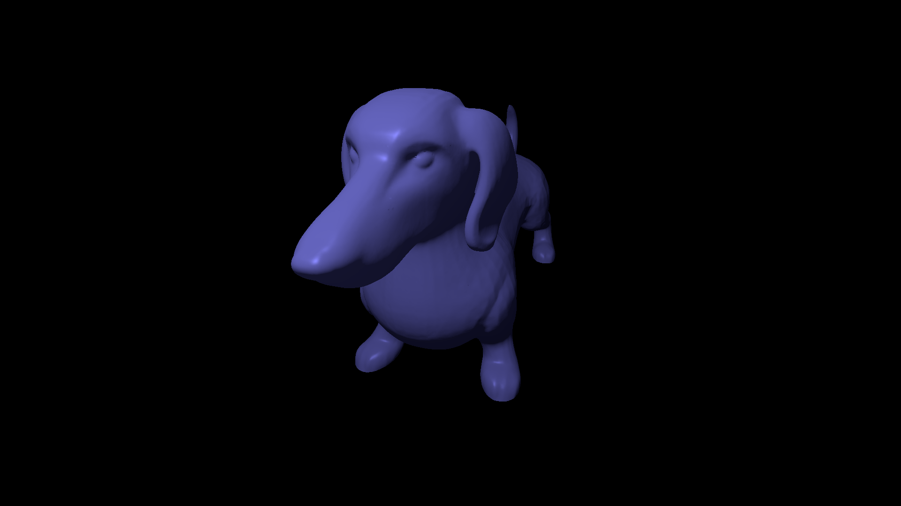

# Vulkan Renderer Demo
A lightweight Vulkan renderer



---
## Features
- Full free-camera controls (WASD + Mouse)
- OBJ mesh loading with tinyobjloader
- Vulkan Memory Allocator (VMA) integration
- Multi-frame synchronization (up to swapchain image count)
- Templated Uniform Buffer Objects (CamUbo, MeshUbo, LightingUbo)
- Build-time SPIR-V compilation (glslc integration)

## Build and run
#### Required Dependencies:
- **Vulkan SDK** 1.4
- **CMake** (3.20 or higher)
- **C++ Compiler** with C++23 support
- **GLFW** 
- **GLM** 
- **VulkanMemoryAllocator** 
- **tinyobjloader**

```powershell
cmake -B build -DCMAKE_BUILD_TYPE=Release
cmake --build build
# launch only from the same directory as executable for correct relative paths.
cd build\src\ 
.\vkhello.exe
```

> **Note:** All dependencies are resolved using `find_package`, including single-header libraries. Make sure to provide `CMake` paths for any custom installation locations of these packages.

## License

This project is MIT licensed. See [LICENSE](LICENSE.txt).


